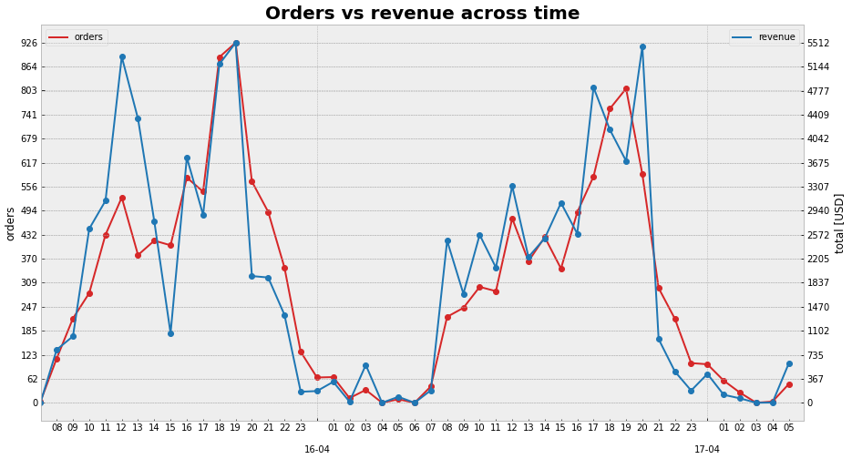

# Challenge Data Engineer for Rappi - 2021

- **Developer:** COLLANTE, Gerardo
- **Date**: 20/6/21

The challenge can be read in `Rappi - Data Engineering Challenge.pdf`.

## Getting Started

------------

To recreate the proposed solution, it is recommended to follow the following steps in CLI:

Clone repository:

`git clone https://github.com/GeraCollante/rappi_data_eng_challenge.git`

### Jupyter Notebook

------------
Install necessary packages:

`pip install nb_requirements.txt`

Open the notebook:

`jupyter-notebook rappi_challenge.ipynb`

### Python File

------------

Create docker image from `Dockerfile` (in this case name of the image is `rappi-challenge`):

`sudo docker build -t rappi-challenge .`

#### Just run

Only run docker conteiner:

`docker run -ti rappi-challenge`

#### Interactive terminal

Run docker conteiner with interactive terminal:

`docker run -ti rappi-challenge /bin/bash`

Run `.py` file:

`python rappi-challenge.py`

## Data Analysis

------------

- **Percentage of payment method per store:** It allows to quickly identify the stores that most use cash or cc.

- **Time Series**: The peaks of activity both in the number of orders and in billing occurs between 6:00 p.m. and 8:00 p.m., drastically decreasing in the early hours of the morning. Flash promotions would be beneficial to perform at that time but the availability of rappis is unknown.

- **AOV**: We must focus on products with a large number of orders and prices, but which are far away, proposing strategically located warehouses to reduce delivery time., In this case we must focus on products with lots of orders and price, but they are far, proposing deposits located strategically to reduce delivery time.

