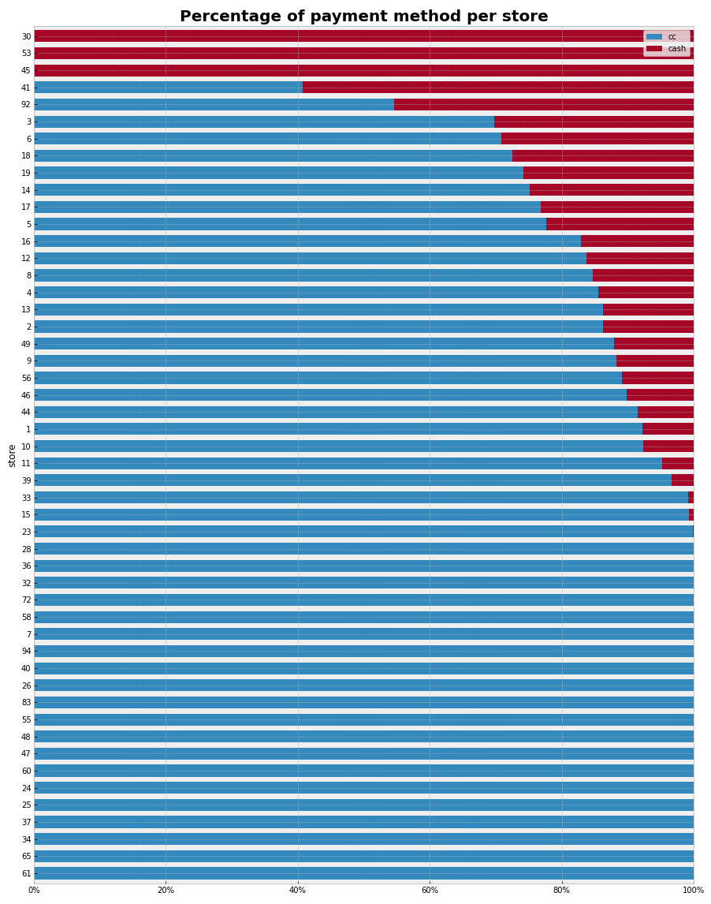

**Challenge Data Engineer for Rappi - 2021**

- **Developer:** COLLANTE, Gerardo
- **Date**: 25/6/21

The challenge can be read in `Rappi - Data Engineering Challenge.pdf`.

# Table of Contents

- [Table of Contents](#table-of-contents)
  - [Getting Started](#getting-started)
    - [Jupyter Notebook](#jupyter-notebook)
    - [Python File](#python-file)
      - [Interactive terminal](#interactive-terminal)
      - [Just run](#just-run)
  - [Results](#results)
    - [Ranking](#ranking)
    - [Data Analysis](#data-analysis)

## Getting Started

------------

To recreate the proposed solution, it is recommended to follow the following steps in CLI:

Clone repository:

`git clone https://github.com/GeraCollante/rappi_data_eng_challenge.git`

### Jupyter Notebook

------------
Install necessary packages:

`pip install nb_requirements.txt`

Open the notebook:

`jupyter-notebook rappi_challenge.ipynb`

### Python File

------------

Create docker image from `Dockerfile` (in this case name of the image is `rappi-challenge`):

`docker build -t rappi-challenge .`

#### Interactive terminal

Run docker container with interactive terminal:

`docker run -ti rappi-challenge /bin/bash`

Run `.py` file:

`python main.py`

#### Just run

Only run bash script and interactive terminal will be open:

`sh docker-run.sh`

Run `.py` file:

`python main.py`

## Results

------------

### Ranking

| ranking | store | revenue [USD] | pct_cc   | pct_cash | aov [USD]  |
|---------|-------|---------|----------|----------|-------|
| 1       | 1     | 64439   | 92,27 %  | 7,73 %   | 9,94  |
| 2       | 13    | 6862    | 86,27 %  | 13,73 %  | 5,48  |
| 3       | 9     | 5846    | 88,30 %  | 11,70 %  | 4,33  |
| 4       | 4     | 1857    | 85,56 %  | 14,44 %  | 2,85  |
| 5       | 5     | 1370    | 77,68 %  | 22,32 %  | 1,86  |
| 6       | 12    | 1354    | 83,70 %  | 16,30 %  | 1,74  |
| 7       | 3     | 1277    | 69,72 %  | 30,28 %  | 2,72  |
| 8       | 2     | 1234    | 86,32 %  | 13,68 %  | 3,44  |
| 9       | 8     | 987     | 84,70 %  | 15,30 %  | 1,26  |
| 10      | 16    | 809     | 82,97 %  | 17,03 %  | 2,77  |
| 11      | 23    | 596     | 99,90 %  | 0,10 %   | 19,22 |
| 12      | 18    | 394     | 72,51 %  | 27,49 %  | 1,43  |
| 13      | 10    | 280     | 92,40 %  | 7,60 %   | 3,15  |
| 14      | 14    | 264     | 75,15 %  | 24,85 %  | 1,19  |
| 15      | 19    | 255     | 74,15 %  | 25,85 %  | 1,37  |
| 16      | 11    | 227     | 95,20 %  | 4,80 %   | 3,61  |
| 17      | 36    | 128     | 100,00 % | 0,00 %   | 9,82  |
| 18      | 47    | 106     | 100,00 % | 0,00 %   | 7,58  |
| 19      | 15    | 63      | 99,24 %  | 0,76 %   | 7,89  |
| 20      | 26    | 49      | 100,00 % | 0,00 %   | 1,87  |
| 21      | 6     | 47      | 70,87 %  | 29,13 %  | 2,46  |
| 22      | 83    | 31      | 100,00 % | 0,00 %   | 6,11  |
| 23      | 41    | 30      | 40,72 %  | 59,28 %  | 1,85  |
| 24      | 17    | 25      | 76,77 %  | 23,23 %  | 1,47  |
| 25      | 40    | 17      | 100,00 % | 0,00 %   | 8,29  |
| 26      | 25    | 16      | 100,00 % | 0,00 %   | 3,26  |
| 27      | 33    | 15      | 99,15 %  | 0,85 %   | 3,01  |
| 28      | 24    | 13      | 100,00 % | 0,00 %   | 3,20  |
| 29      | 37    | 11      | 100,00 % | 0,00 %   | 3,58  |
| 30      | 65    | 10      | 100,00 % | 0,00 %   | 4,96  |
| 31      | 56    | 9       | 89,10 %  | 10,90 %  | 0,91  |
| 32      | 72    | 9       | 100,00 % | 0,00 %   | 8,81  |
| 33      | 34    | 9       | 100,00 % | 0,00 %   | 4,36  |
| 34      | 39    | 7       | 96,65 %  | 3,35 %   | 1,05  |
| 35      | 94    | 7       | 100,00 % | 0,00 %   | 6,85  |
| 36      | 46    | 5       | 89,82 %  | 10,18 %  | 1,78  |
| 37      | 48    | 5       | 100,00 % | 0,00 %   | 2,67  |
| 38      | 92    | 5       | 54,65 %  | 45,35 %  | 2,39  |
| 39      | 55    | 4       | 100,00 % | 0,00 %   | 2,10  |
| 40      | 61    | 4       | 100,00 % | 0,00 %   | 2,06  |
| 41      | 49    | 4       | 87,96 %  | 12,04 %  | 1,97  |
| 42      | 44    | 3       | 91,53 %  | 8,47 %   | 1,09  |
| 43      | 60    | 3       | 100,00 % | 0,00 %   | 2,83  |
| 44      | 32    | 3       | 100,00 % | 0,00 %   | 1,32  |
| 45      | 28    | 1       | 100,00 % | 0,00 %   | 1,42  |
| 46      | 45    | 1       | 0,00 %   | 100,00 % | 1,27  |
| 47      | 7     | 1       | 100,00 % | 0,00 %   | 1,22  |
| 48      | 53    | 1       | 0,00 %   | 100,00 % | 0,60  |
| 49      | 58    | 0       | 100,00 % | 0,00 %   | 0,41  |
| 50      | 30    | 0       | 0,00 %   | 100,00 % | 0,29  |
| 51      | 50    | 0       | 0,00 %   | 0,00 %   | 0,00  |
| 52      | 71    | 0       | 0,00 %   | 0,00 %   | 0,00  |
| 53      | 54    | 0       | 0,00 %   | 0,00 %   | 0,00  |

### Data Analysis

- **Revenue per store**: Clearly there is a store that earns much more than the others stores, making that their revenues seems insignificants.

- **Revenue per store (others)**: Due to the fact that the main store distorts the axis of the graph, it was decided to make a new plot excluding it, and also leaving the stores that earned at least 50usd.
.")

- **Percentage of payment method per store:** It allows to quickly identify the stores that most use cash or cc.

- **AOV:** It shows the AOV, in green those that are above the average and in red those that are below.

- **Time Series**: The peaks of activity both in the number of orders and in billing occurs between 6:00 p.m. and 8:00 p.m., drastically decreasing in the early hours of the morning. Flash promotions would be beneficial to perform at that time but the availability of rappis is unknown.

- **Orders vs distance per product**: We must focus on products with a large number of orders and prices, but which are far away, proposing strategically located warehouses to reduce delivery time., In this case we must focus on products with lots of orders and price, but they are far, proposing deposits located strategically to reduce delivery time.

